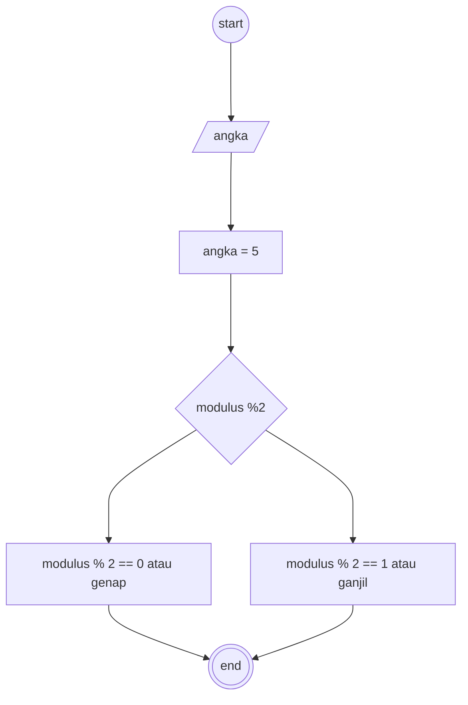

# task 4

```mermaid
flowchart TB
circle((start)) ---> isi[/angka/]
isi ---> isiData[angka = 5]
isiData ---> modulus{modulus %2}
modulus ---> sisa0[modulus % 2 == 0 atau genap]
modulus ---> sisa1[modulus % 2 == 1 atau ganjil]

sisa0 --> selesai((end))
sisa1 --> selesai(((end)))
```
