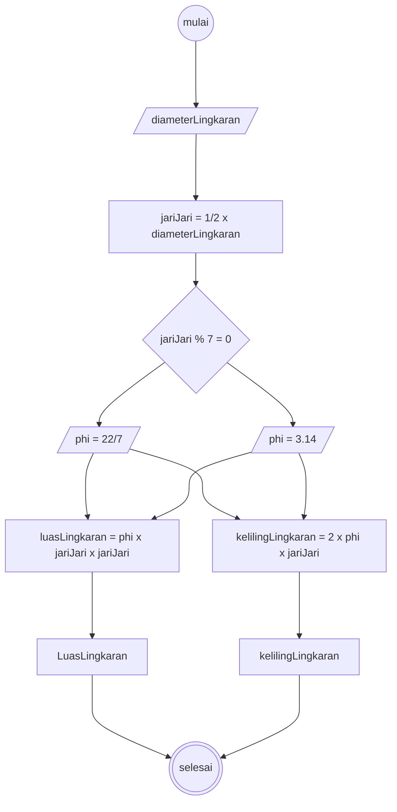

```mermaid
flowchart TB
circle((mulai)) --->data[/diameterLingkaran/]


jari --> phi{jariJari % 7 = 0}
phi --> phi1[/phi = 22/7/]
phi --> phi2[/phi = 3.14/]


data---> jari[jariJari = 1/2 x diameterLingkaran]
phi1 --->luas[luasLingkaran = phi x jari - jari x jari - jari]

phi1 --->keliling[kelilingLingkaran = 2 x phi x jari - jari]
phi2 --->luas[luasLingkaran = phi x jariJari x jariJari]

phi2 --->keliling[kelilingLingkaran = 2 x phi x jariJari]

luas ---> hasil1[LuasLingkaran]
keliling---> hasil2[kelilingLingkaran]

hasil1---> selesai(((selesai)))
hasil2---> selesai(((selesai)))
```
