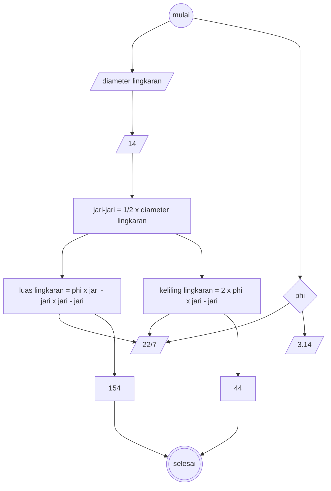

```mermaid
flowchart TB
circle((mulai)) --->data[/diameter lingkaran/]

circle --> phi{phi}
phi --> phi1[/22/7/]
phi --> phi2[/3.14/]

data--->output[/14/]

output---> jari[jari-jari = 1/2 x diameter lingkaran]
jari --->luas[luas lingkaran = phi x jari - jari x jari - jari]

jari --->keliling[keliling lingkaran = 2 x phi x jari - jari]

keliling --> phi1
luas --> phi1
luas ---> hasil1[154]
keliling---> hasil2[44]

hasil1---> selesai(((selesai)))
hasil2---> selesai(((selesai)))
```
