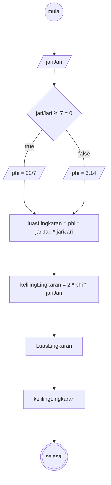

```mermaid
flowchart TB
circle((mulai)) --->data[/jariJari/]


phi -- true ---phi1[/phi = 22/7/]
phi -- false ---phi2[/phi = 3.14/]


data --> phi{jariJari % 7 = 0}
phi1 --->luas[luasLingkaran = phi * jariJari * jariJari]
phi2 --->luas[luasLingkaran = phi * jariJari * jariJari]

luas --->keliling[kelilingLingkaran = 2 * phi * jariJari]

keliling ---> hasil1[LuasLingkaran]
hasil1---> hasil2[kelilingLingkaran]

hasil2---> selesai(((selesai)))
```
