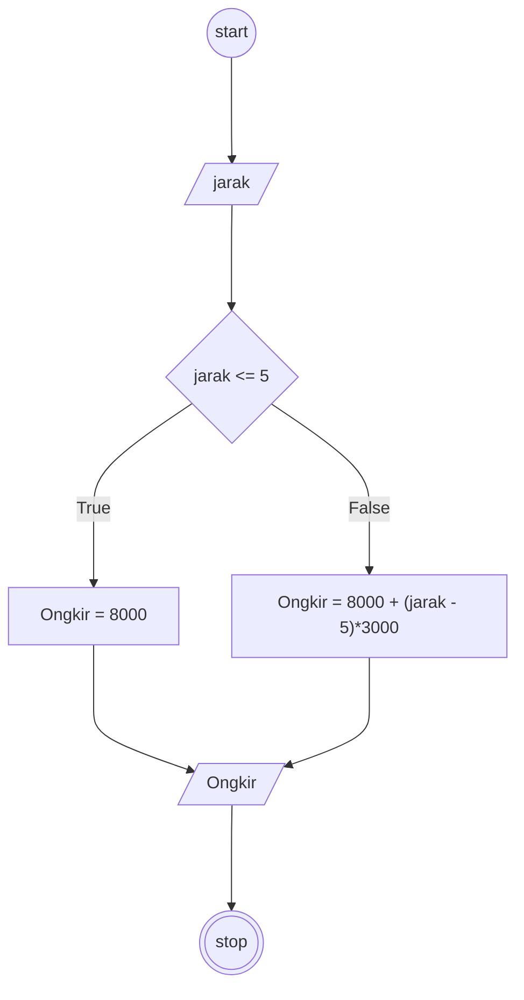

```mermaid
flowchart TB

circle((start))

circle--->id[/jarak/]

id--->jauh{jarak <= 5}

jauh --True ---> ongkos1[Ongkir = 8000]
jauh --False ---> ongkos2["Ongkir = 8000 + (jarak - 5)*3000"]

ongkos1 ---> total[/Ongkir/]
ongkos2 ---> total[/Ongkir/]

total---> selesai(((stop)))
```
