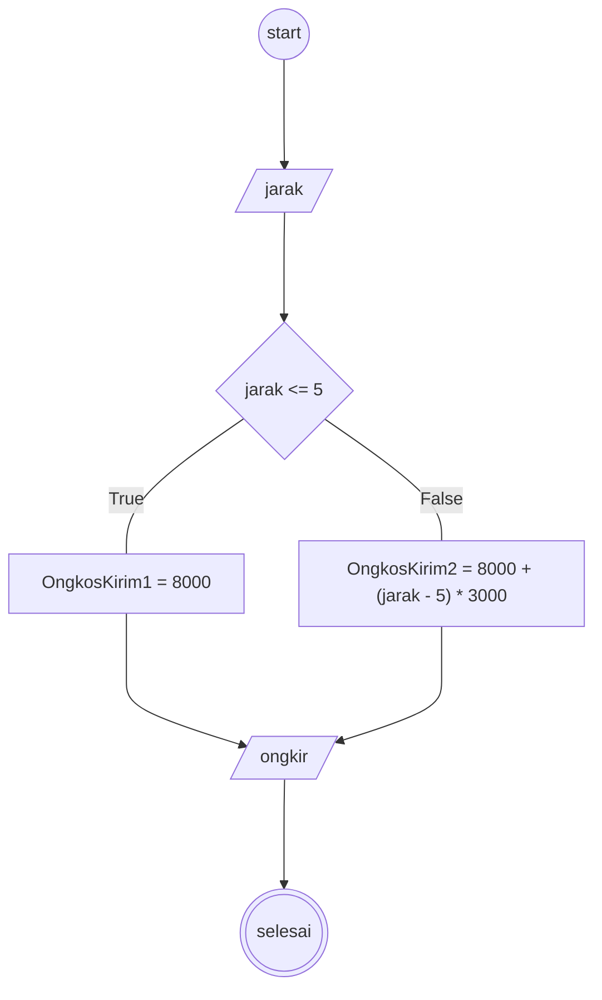

```mermaid
flowchart TB

circle((start))

circle--->id[/jarak/]

id--->jauh{jarak <= 5}

jauh --True --- ongkos1[OngkosKirim1 = 8000]
jauh --False --- ongkos2["OngkosKirim2 = 8000 + (jarak - 5) * 3000"]

ongkos1 ---> total[/ongkir/]
ongkos2 ---> total[/ongkir/]

total---> selesai(((selesai)))
```
