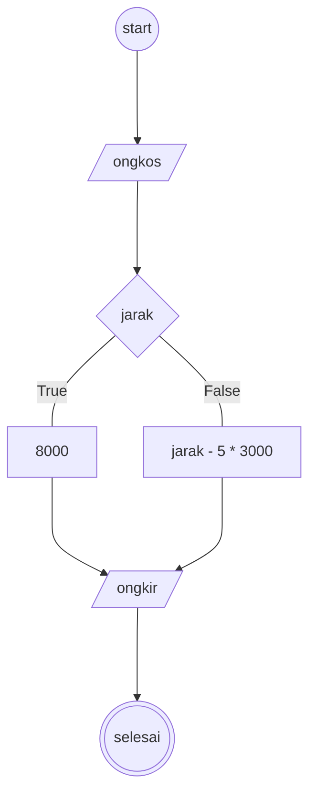

```mermaid
flowchart TB

circle((start))

circle--->id[/ongkos/]

id--->jauh{jarak}

jauh --True --- ongkos1[8000]
jauh --False --- ongkos2[jarak - 5 * 3000]

ongkos1 ---> total[/ongkir/]
ongkos2 ---> total[/ongkir/]

total---> selesai(((selesai)))
```
