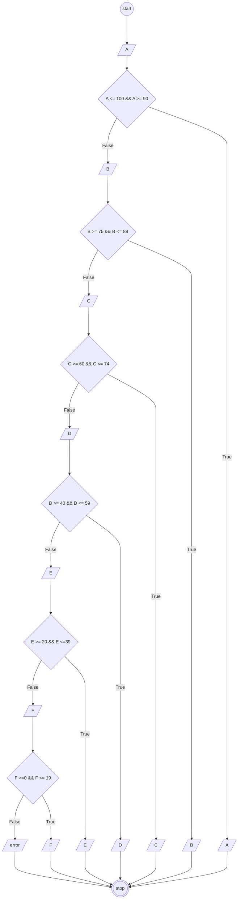

```mermaid
flowchart TB

start((start))

start--->input1[/A/]

%% Decision A %%
input1-->Adec{A <= 100 && A >= 90}
Adec--False --->false1[/B/]
Adec--True --->hasil1[/A/]

%% Decision B %%

false1--->Bdec{B >= 75 && B <= 89}
Bdec--False--->false2[/C/]
Bdec--True--->hasil2[/B/]

%% Decision C %%

false2--->Cdec{C >= 60 && C <= 74}
Cdec--False--->false3[/D/]
Cdec--True --->hasil3[/C/]

%% Decision D %%

false3--->Ddec{D >= 40 && D <= 59}
Ddec--False--->false4[/E/]
Ddec--True--->hasil4[/D/]

%% Decision E %%
false4--->Edec{E >= 20 && E <=39}
Edec--False--->false5[/F/]
Edec--True--->hasil5[/E/]

%% Decision F %%
false5--->eFdec{F >=0 && F <= 19 }
eFdec--False--->false6[/error/]
eFdec--True--->hasil6[/F/]

false6--->fin(((stop)))
hasil1--->fin(((stop)))
hasil2--->fin(((stop)))
hasil3--->fin(((stop)))
hasil4--->fin(((stop)))
hasil5--->fin(((stop)))
hasil6--->fin(((stop)))
```
