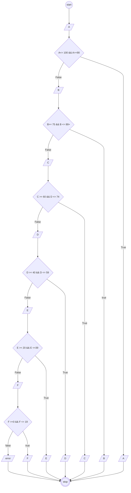

```mermaid
flowchart TB

circle((start))

circle--->input1[/A/]

%% Desicion A %%
input1-->A{A<= 100 && A>=90}
A--False --->false1[/B/]
A--True --->hasil1[/A/]

%% Desicion B %%

false1--->B{B>= 75 && B <= 89>}
B--False--->false2[/C/]
B--true--->hasil2[/B/]

%% Desicion C %%

false2--->C{C >= 60 && D <= 74}
C--False--->false3[/D/]
C--True --->hasil3[/C/]

%% Desicion D %%

false3--->D{D >= 40 && D <= 59}
D--False--->false4[/E/]
D--True--->hasil4[/D/]

%% Desicion E %%
false4--->E{E >= 20 && E <=39}
E--False--->false5[/F/]
E--True--->hasil5[/E/]

%% Desicion F %%
false5--->eF{F >=0 && F <= 19 }
eF--false--->false6[/error/]
eF--true--->hasil6[/F/]

false6--->fin(((stop)))
hasil1--->fin(((stop)))
hasil2--->fin(((stop)))
hasil3--->fin(((stop)))
hasil4--->fin(((stop)))
hasil5--->fin(((stop)))
hasil6--->fin(((stop)))
```
